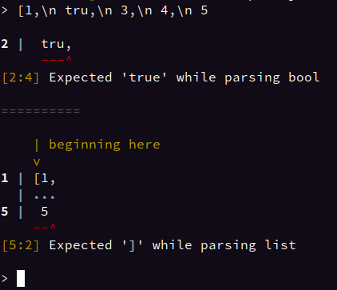

# Untwine

The prettier pattern-matching parser with automatic error recovery


Untwine is a declarative parsing library which allows a style of parsing which is similar to direct pattern matching using a custom macro syntax.
This allows the creation of extremely compact parsers with decent performance characteristics and high-quality error messages.
These parsers are simple to implement, with a couple cherry-picked examples being:
- A nearly-complete JSON parser in 12 lines of parsing logic
  - Supports all basic JSON functionality except for special escape sequences (those other than \\")
- A pmdas-respecting four-operation expression parser in 6 lines of parsing logic
  - And one helper function to operate on two numbers

Parsers made using untwine also have high-quality error messages visually displaying the error and relevant syntax.

## Usage

This readme will mostly cover examples and features. For full usage instructions, see https://docs.rs/untwine/latest/untwine/macro.parser.html.

## Simple, declarative parsing

Untwine allows you to parse by simply describing the syntax you want to parse, and selecting the parts of the output you want.
Below is the code implementing an expression parser in Untwine.

```rust
fn operate(left: f64, op: char, right: f64) -> f64 {
    match op {
        '+' => left + right,
        '-' => left - right,
        '/' => left / right,
        '*' => left * right,
        _ => unreachable!(),
    }
}

parser! {
    sep = #{char::is_ascii_whitespace}*;
    num: num=<"-"? '0'-'9'+ ("." '0'-'9'+)?> -> f64 { num.parse().unwrap() }
    term = (num | "(" sep expr sep ")") -> f64;
    add: first=mul sep ops=(["+-"] sep mul)* -> f64 { ops.into_iter().fold(first, |left, (op, right)| operate(left, op, right)) }
    mul: first=term sep ops=(["*/"] sep term)* -> f64 { ops.into_iter().fold(first, |left, (op, right)| operate(left, op, right)) }
    pub expr = add -> f64;
}
```

While this guide will not seek to fully explain the parser, there are several key features on show.
First, the syntax is somewhat similar to Regex or EBNF. Each parser declares the pattern it is matching
against, and may use `name=` in front of any top-level pattern to extract the value of that pattern
into a variable. Once the structure is matched, you evaluate the output of the parser in a code block.

The benefit of this approach is leveraging the power of a formal grammar while still allowing full
integration with the type system and IDE insight.

In addition to sheer brevity, the parsers boast colorful errors generated automatically from the syntax
you described, and will effectively illustrate any syntax errors.

## Errors

Here I will showcase some of the errors generated by both the expression parser and the JSON parser. These
were obtained through the example REPLs, which can be run with `cargo run --example expr` and `cargo run --example json`
respectively.


Untwine supports automatic error recovery, enabling the same 12 lines of code to continue parsing after an error to
discover more errors. A recovered input with error nodes can also be obtained.


Since errors indicate a range rather than just a single position, multiline errors are also supported:



To see the full implementation of both of these parsers, see [examples/json.rs](https://github.com/boxbeam/untwine/blob/master/examples/json.rs)
and [examples/expr.rs](https://github.com/boxbeam/untwine/blob/master/examples/json.rs)

## Performance and goals

While Untwine currently has no formal benchmarks, informally I have found parsers written using Untwine to be about
two-thirds as fast as a basic but well-optimized handwritten parser. While Untwine seeks to offer high performance,
it is not suitable for highly performance-critical parsers.

Most parsing is not so performance-critical, and Untwine is ideal for building programming languages or DSLs,
where high-quality error messages are more important. It seeks to make parsing so easy that it becomes worthwhile to
write parsers where it may not have been before, giving you the ability to iterate extremely quickly and eliminate
most of the pain points of manual parsing.
